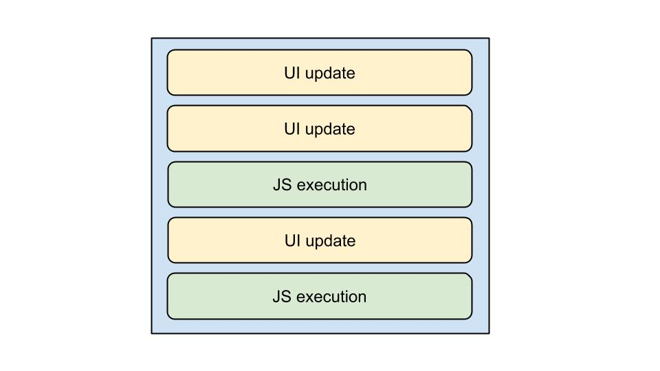
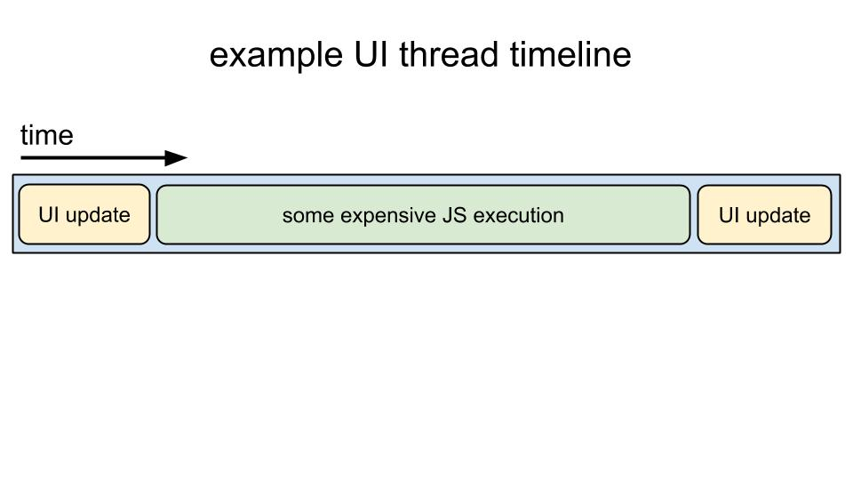
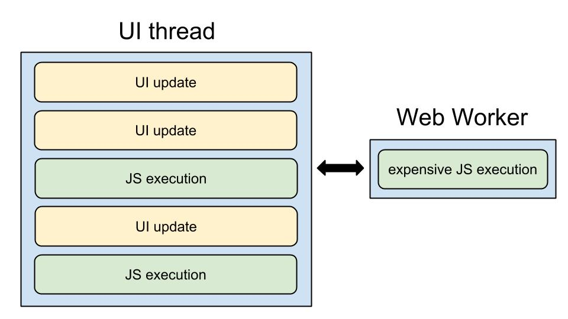
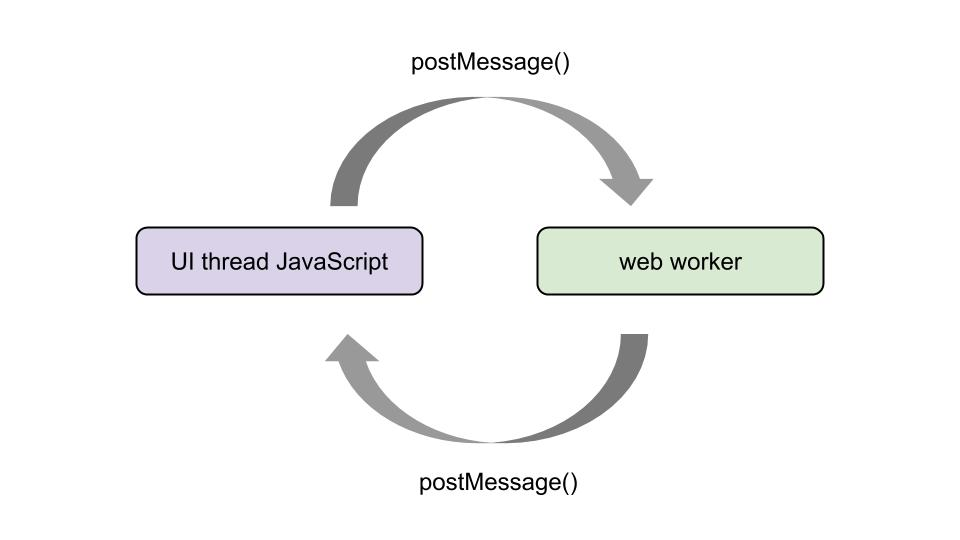
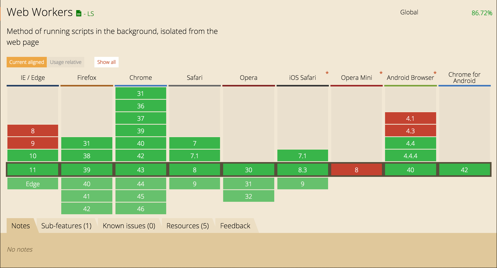
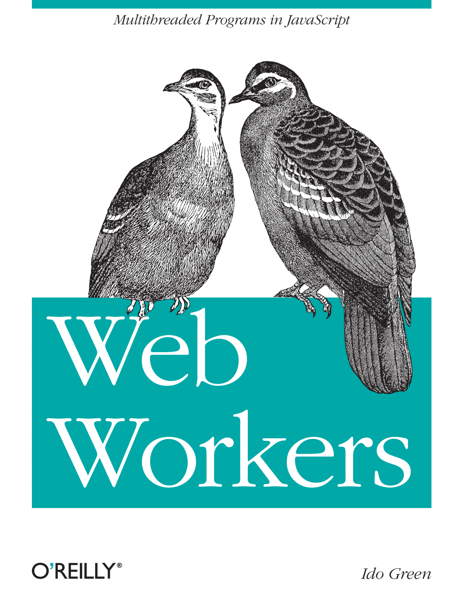

# Web Workers


---


## Web workers are ~~a way of pretending we have~~ **threads you can use in browsers.**


---


## Web workers **are actually OS level threads.**


---


## Web workers **provide a way to run JavaScript work outside of the main browser event loop (UI thread).**


---

# Huh?

---

# browser event loop

---





---




---


# execution bottlenecks = slow UI
# 🐢


---


# demo


---


# slow UI = sad UX
# 😢


---


# what can we do?


---




---

# 😍 🐇

---


# how does it work?


---





---

# Example 

```javascript

// from the UI thread

// create new worker, point to worker file
var myWorker = new Worker("worker.js");

```
---

# Example 

```javascript

// from the UI thread

// create new worker, point to worker file
var myWorker = new Worker("worker.js");

// send strings, arrays, numbers, objects...
myWorker.postMessage([1, 2]);

```
---

# Worker Example 

```javascript

// from worker.js

onmessage = function(e) {
  var workerResult = 'the sum is ' + (e.data[0] + e.data[1]);
  postMessage(workerResult);
}

```
---

# Back to the UI thread 

```javascript

// message listener
myWorker.onmessage = function(e) {
  console.log(e.data); // 'the sum is 3'
}

```
---

# Back to the UI thread 

```javascript

// message listener
myWorker.onmessage = function(e) {
  $('.myDiv').html(e.data);
}

```
---

# Back to the UI thread 

```javascript

// create new worker, point to worker file
var myWorker = new Worker("worker.js");

// send strings, arrays, numbers, objects...
myWorker.postMessage([1, 2]);

// message listener
myWorker.onmessage = function(e) {
  $('.myDiv').html(e.data);
}

```
---


# demo


---

# Can I use libraries within Web Workers?

---

# Yes!

```javascript

// within worker.js
importScripts('underscore.js', 'handlebars.js');

```

---

# How do I get rid of a Worker when I no longer need it?

---

# How do I get rid of a Worker when I no longer need it?

```javascript

// from UI thread
myWorker.terminate();
```

---


---

# Slightly better

```javascript

// from UI thread
myWorker.postMessage('worker:close');


// from worker.js
onmessage = function(e) {
  if (e.data === 'worker:close') {
    close();
  }
}
```

---


# Can I spawn a Web Worker from a Web Worker?

---

# YES YOU CAN


---

# Limitations

---



---

# No cross origin shenanigans

---

# No DOM access 
# (AJAX is cool though)

---

# You **can** crash the browser if you spawn too many Workers.

---





